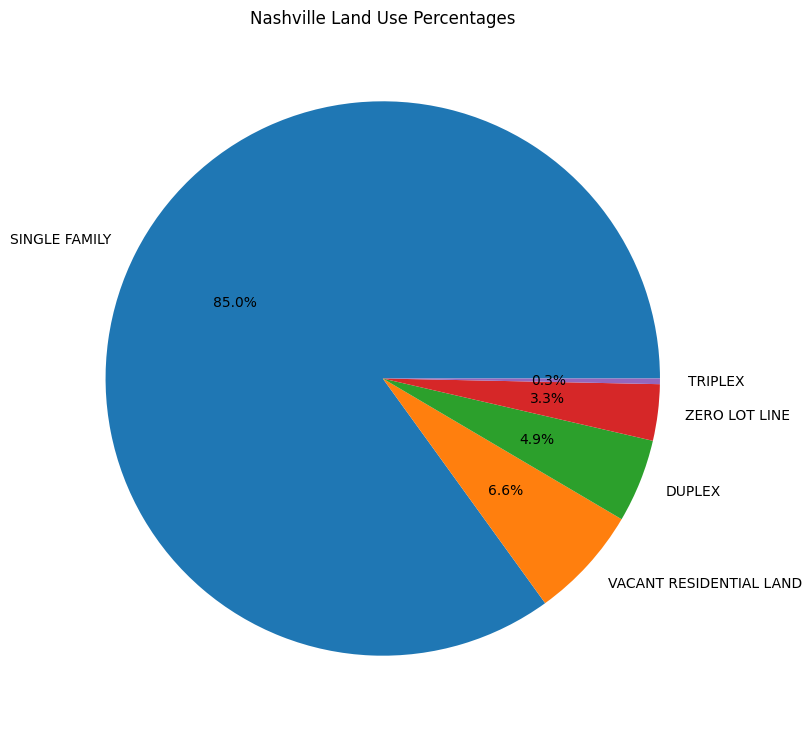
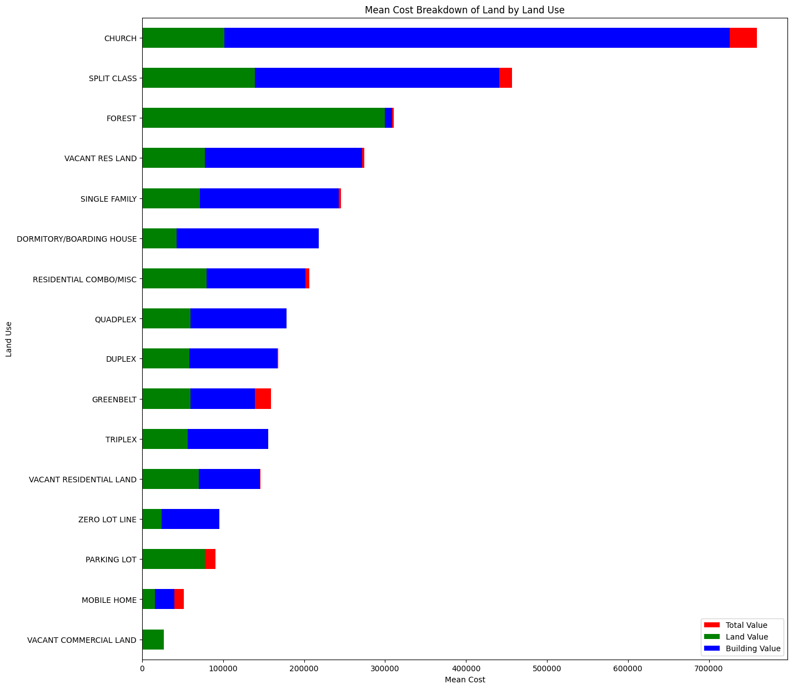
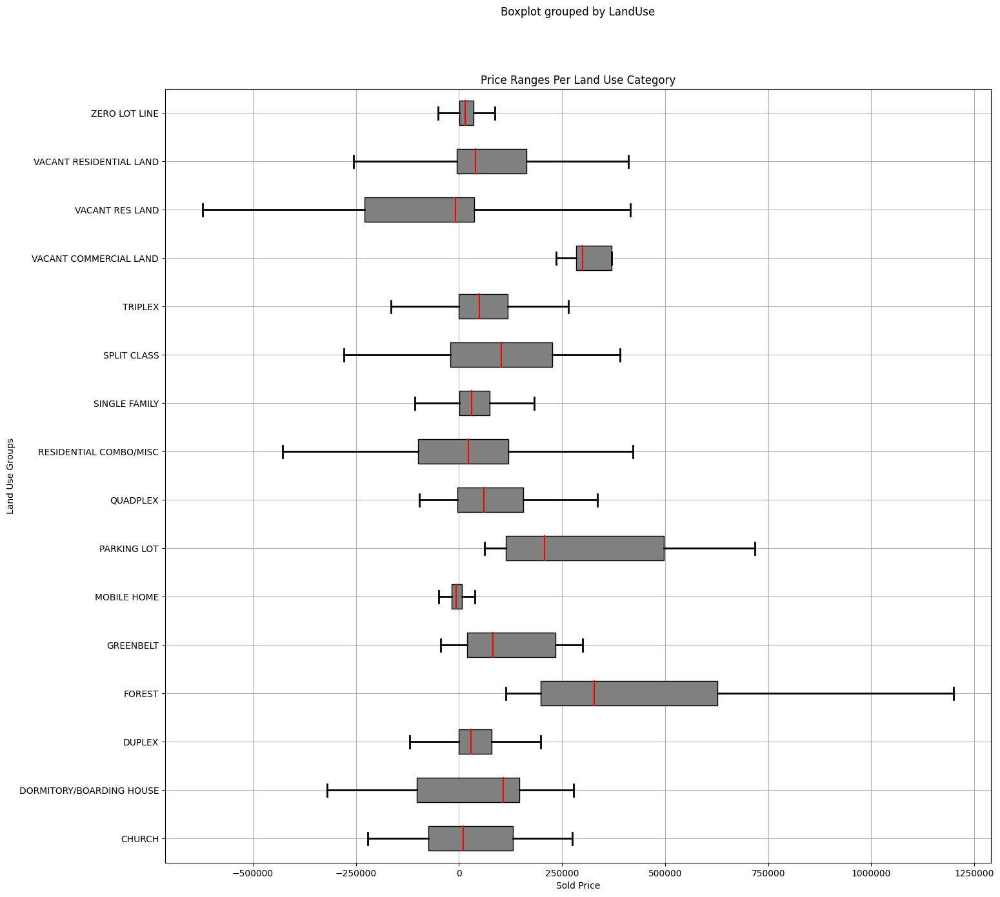
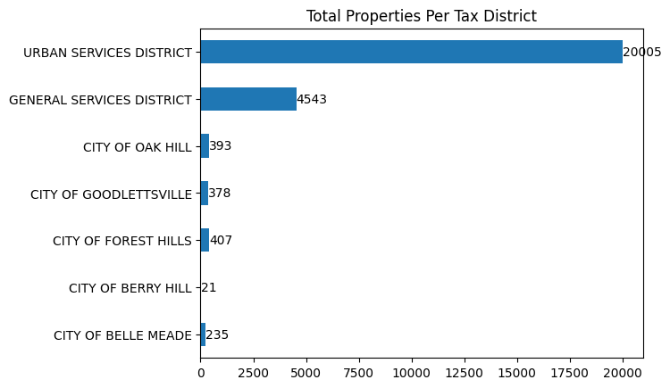
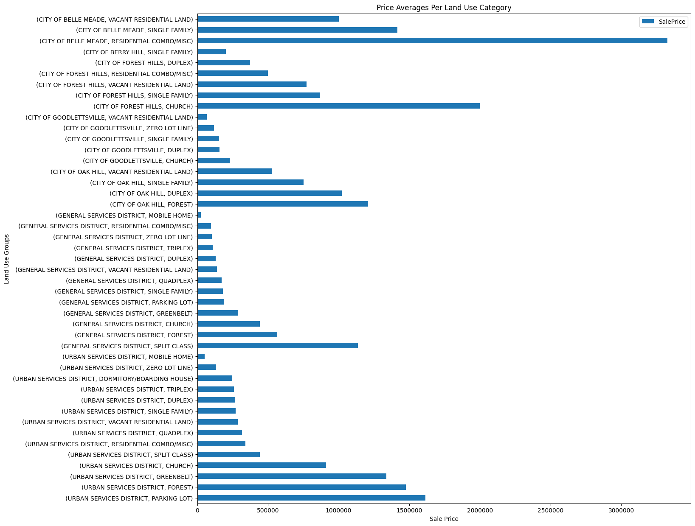

## Overview

Nashville is the capital of the U.S. state of Tennessee and home to The Country Music Hall of Fame and Museum. From this music hub which is home to a population of nearly 700,000 people, we have a trove of data waiting to be explored. This presentation is going to be focused on the real estate data of the Nashville area. It is important to review this data to understand the zones and compositon of the Nashville area. The primary focus of this dataset is the different types of properties along with the the cost breakdown.

## Questions
- What are the most common types of properties?
- What is the value by each type of property?
- Where are the most costly types of properties?

## Cleaning
This data was luckily pretty easy to work with due to the smaller number of columns and with most of the data filled. For the initial cleaning I cut out columns that I didn't need and were unecessary. Afterwards I checked for any nulls or zeros and if there were any nulls within my numeric data then I changed them to zero. I did remove those values where the total value or acreage were zero. I did not remove every zero with things such as bedrooms and bathrooms since it wouldn't make sense to do so. It was also brought to my attention while I was calculating my averages and highest prices that for some strange reason the sales price column of my data was listed as a string instead of an integer so I had to go through my columns and make sure they all were integers. After my initial exploration into my dataset I noticed there were a large amount of groups that had very few entries and would throw off all of my charts and data so I ended up trimming those with fewer than 5 entries to limt the outliers when it came to finding averages and sums. After that I had a clean set of data ready to be used for my analysis.

## Visualization
 Here we can see that the majority of the properties are Single Familiy properties taking up 85% of the entries. Even looking at the other categories of the top 5 listed here are all residential. This leave less than .1% of the rest of data for all the types of properties.
 

 
To start off the visualization we can look at the average value of each property type. Looking at this chart we can see the total value of the property broken down into its land value and building value and see how some property types have a bit of a surcharge.

 

 
Base value isn't sale value though and we can look at the difference between the sale price and the total value to see how well each property sells and the positive or negative value the type has on its final sale price. By viewing this chart we can see which type of properties sell over or undervalue and by looking at this chart we can see for the most part most types of properties sell close to their total value.
 

 

Looking at the different districts we can see how the majority of the properties fall under the Urban Services District which makes sense as the majority of our data is based on residental properties. We can then look at the top 10 Tax Districts broken down into Land Use Categories and see that we can confirm that the highest amount of properties are Single Family Homes within the Urban Services District with second place going to General Service District for Single Family Homes as well.
 

 

But as every realtor will tell you, the most important thing about a property is location, location, location. Now that we have identified the most common type of property along with the district we can start looking at the cost of these properties and break down where the value of these properties are coming from. First looking at the average cost of each type of property per district we can get a rough idea of the value of the location. By viewing these averages with our previous total value graph, we are able to get a more clear picture of the prices available of each property type per area.
 

 

## Conclusion
It is quite clear that the most common type of within this data are some type of home with single family homes being by far the most common. Looking at the districts we can see that the majority of properties are located in the Urban District and the General Services District having the vast majority of the properties within them. Looking at the costs of each property we could have a bit of skewed data due to the low the amount of data points in some of the property types but a pretty clear view that in most cases the value of a property comes from the building with some exceptions. Finally looking at the difference between the sale price and the total value of the home we can get an idea of how much these properties are being sold for and whether the property type increases or decreases with value. Finally we can view the general location of each property by tax district and see the average value of each property type within its district and see where the most and least expensive properties on average can be found.

##  Future Project Plans
Ways I can improve on this project in the future is by finding more data on the other property types to have a better breakdown of all property values and make sure I have better averages. I can also find a map of the tax districts in order to show where these locations are and maybe see why some of the price averages are higher than others. A big improvement that could be made is consolidating the code in order to improve reusability as even with the little code I was able to refactor into functions were made much more flexible and could be implemented in later projects.
